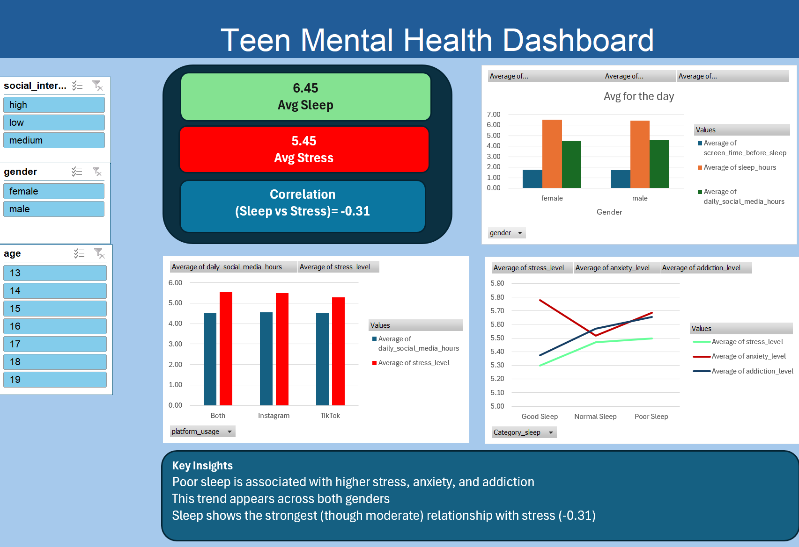

# Teen Mental Health Dashboard           

## Project Overview
This project explores how sleep affects stress, anxiety, and addiction levels among teenagers using Excel dashboards and correlation analysis.

## Dataset
[Social Media Impact on Teen Mental Health](https://www.kaggle.com/datasets/algozee/teenager-menthal-healy/data)        

##  Tools Used 
- Microsoft Excel
- Pivot Tables
- Data Visualization     
- Correlation Analysis  

##  Key Insights
- Poor sleep is associated with higher stress, anxiety, and addiction.  
- This trend appears across both genders.  
- Sleep shows the strongest (though moderate) relationship with stress (-0.31).   

##  Dashboard Preview
    
   
